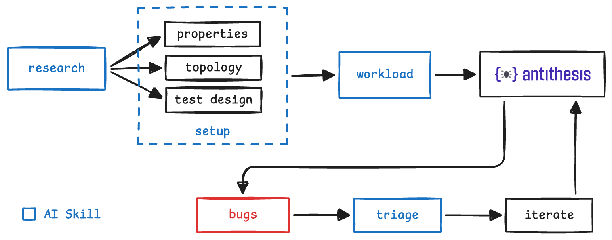

# antithesis-skills

Enable AI agents to set up Antithesis, bootstrap your first Antithesis test, launch Antithesis runs, and triage the results.

> Table of contents:  
> **[Working with LLM agents](#working-with-llm-agents)** · **[Recommended workflow](#recommended-workflow)** · **[Starter prompts](#starter-prompts)** · **[Prerequisites](#prerequisites)** · **[Install](#install)**

## Skills overview

`antithesis-documentation` is a foundational skill that enables agents to work with [our docs](https://antithesis.com/docs/) more efficiently. It's used by the research, setup, and workload skills. You can also use it to ask questions about how to use Antithesis.

`antithesis-research`, `antithesis-setup`, and `antithesis-workload` work together to bootstrap a new system into Antithesis. Together, they will:

- Analyze your system to provide a basic catalog of relevant [reliability properties](https://antithesis.com/docs/resources/reliability_glossary/).
- Provide a suggested system topology for testing.
- Handle your [initial deployment to Antithesis](https://antithesis.com/docs/getting_started/setup/).
- Create a basic [test template](https://antithesis.com/docs/test_templates/) to validate properties in the catalog.

**`antithesis-research` produces planning artifacts that you should review carefully.**

> [!IMPORTANT]
> `antithesis-research` is thorough by design. It fans out across sub-agents to study your system from several angles — reading source, comments, docs, commit history, and issues — then runs multiple evaluation passes over the properties it discovers. That depth is what makes the artifacts valuable, but it also means the run is not quick: on most codebases, expect it to work for > _30 minutes to an hour_* and to use a meaningful amount of tokens along the way.

`antithesis-setup-k8s` is for customers running on Kubernetes who would like to get their Kubernetes setup running in Antithesis. Starting from a set of Kubernetes Manifests, it is an interview-driven assistant that will help customers get their applications running in Kubernetes running in Kubernetes in Antithesis mmaking sure that the manifests conform to the Antithesis requirements. 

`antithesis-k8s-onboarding-assistance` is for customers running on Kubernetes who wish to run on Antithesis using a docker-compose setup. It's an interview-driven assistant that helps the customer (and the Antithesis engagement team) figure out what's in the k8s setup, what to keep/drop/stub for testing, and produces structured questions the customer can take to their ops team. K8s customers run it before `antithesis-setup`.

> [!NOTE]
> `antithesis-k8s-onboarding-assistance` is more experimental than the other skills here. Unlike the others, we can't realistically dogfood it without a real customer engagement — we genuinely don't know how well it works in practice yet. If you use it, please file feedback aggressively. Every real engagement teaches us something we couldn't learn synthetically.

`antithesis-triage` enables agents to parse and analyze the results of your Antithesis test runs.

`antithesis-debug` enables agents to interactively debug Antithesis test runs using the [multiverse debugger](https://antithesis.com/docs/multiverse_debugging/) — inspecting container filesystems and runtime state, running shell commands, and extracting evidence from inside the Antithesis environment.

`antithesis-query-logs` enables agents to search across all timelines in an Antithesis test run to find events, correlate property failures, and answer temporal questions about ordering and causation — e.g., cascade elimination, fault correlation, and root cause hypothesis testing.

`antithesis-agent-browser` is a helper skill that handles interactive browser authentication to your Antithesis tenant and reads Antithesis web pages. Other skills (e.g. `antithesis-debug`, `antithesis-query-logs`) delegate to it when they need authenticated web access; you usually won't invoke it directly.

`antithesis-launch` enables agents to build the harness, run `snouty validate`, and submit `snouty launch` with sensible metadata once the harness is ready.

`antithesis-skills-feedback` helps you file bug reports against these skills by opening a pre-filled GitHub issue.

> [!NOTE]
> These skills are under active development. LLMs are inherently non-deterministic, so they may not work perfectly with your AI. Please do file issues and submit PRs as you come across ways to improve them.

## Working with LLM agents

These skills run inside an agent like Claude Code or Codex. Using them well means knowing how to work with the agent itself, not just the skills.

If you're new to agentic tools, or you've been using them for a while and want to dig deeper, read [Getting Started with Antithesis Skills](getting-started-documentation/). It's a companion guide covering mental model, day-to-day working patterns, context and memory, building up your harness, and recognizing failure modes.

## Recommended workflow

<p align="center">
  
</p>

We recommend that you run `antithesis-research`, `antithesis-setup`, and `antithesis-workload` in order and in separate fresh contexts. After running each skill review all of the changes made so far, and iterate on them before continuing to the next skill.

If your system runs on Kubernetes, there are two options: 
1) Run `antithesis-setup-k8s` to help shape your Kubernetes manifests and kick off an Antithesis test that uses Kubernetes as the container orchestrator. This skill is currently in development and does not provide the same experience as antithesis-setup involving instrumentation and SDK usage.
2) Run `antithesis-k8s-onboarding-assistance` before `antithesis-setup` to convert Kubernetes manifests into a docker-compose.yaml to use docker compose as the orchestrator. The skill works with you to figure out which parts of your production k8s setup belong in the test environment, what should be stubbed, and what to drop.

Once the harness is in place, use `antithesis-launch` to run `docker compose build`, `snouty validate`, and `snouty launch` in the right order. We recommend running this after the setup and workload skills to ensure everything is working well.

Don't hesitate to run short 15-30 minute Antithesis test runs as smoke tests to ensure that the harness is working as expected.

## Starter prompts

To get the most out of the skills, we recommend that your prompts simply provide the required information for the skill.

Here are some examples starter prompts.

> [!NOTE]
> There are many ways to invoke a skill, in the examples below, it's invoked with a /skill-name.

### antithesis-research

```
/antithesis-research Research my codebase at /path/to/codebase and prepare a plan to test it with Antithesis.
```

This skill outputs the following research materials, relative to the project directory:

- `antithesis/scratchbook/sut-analysis.md` captures architecture, state, concurrency, and failure-prone areas.
- `antithesis/scratchbook/existing-assertions.md` lists any Antithesis SDK assertions already present in the codebase.
- `antithesis/scratchbook/property-catalog.md` lists concrete, testable properties with priorities.
- `antithesis/scratchbook/deployment-topology.md` describes the minimal useful container topology.
- `antithesis/scratchbook/properties/{slug}.md` per-property evidence files capturing the reasoning, code paths, and key observations behind each property.
- `antithesis/scratchbook/property-relationships.md` maps suspected clusters and connections between properties.
- `antithesis/scratchbook/evaluation/synthesis.md` records categorized evaluation findings and actions taken.
- `antithesis/scratchbook/evaluation/{lens}.md` one per evaluation lens used during property evaluation.

### antithesis-setup

```
/antithesis-setup Review the files in @antithesis/scratchbook/, build the things needed to begin testing with Antithesis, and validate the setup locally.
```

This skill initializes an `antithesis/` directory, relative to the project, and adds all newly created setup files there.

Here's an example:

- `antithesis/Dockerfile` performs a multi-stage build of the SUT.
- `antithesis/config/docker-compose.yaml` orchestrates the SUT.
- `antithesis/setup-complete.sh` emits the `setup_complete` lifecycle event.
- `antithesis/AGENTS.md` documents the `antithesis/` directory.

### antithesis-workload

```
/antithesis-workload Review the plan for testing with Antithesis in @antithesis/scratchbook/property-catalog.md and implement a workload for a single property to start.
```

This skill implements Antithesis workloads and places all the test commands and supporting files under `antithesis/test/`, adds assertions to carefully chosen locations in the SUT.

### antithesis-k8s-onboarding-assistance

```
/antithesis-k8s-onboarding-assistance We use Kubernetes in production. Help us figure out the test environment for Antithesis.
```

This skill produces the following artifacts, relative to the project directory:

- `antithesis/scratchbook/k8s-minimization.md` — the final report describing the test environment (components, dependencies, stubs, decisions). Once setup gains k8s support, setup reads this file directly; until then, it serves as a structured handoff packet for the Antithesis engagement team.
- `antithesis/scratchbook/k8s-minimization-work/working.md` — the live decision history across passes, including reversals and open assumptions.
- `antithesis/scratchbook/k8s-minimization-work/ops-questions.md` — the current open questions for the customer's ops team, formatted for paste-into-Slack response.
- `antithesis/scratchbook/k8s-minimization-work/escalation.md` — generated on demand if the customer needs to loop in their Antithesis engagement team for help.

### antithesis-launch

```
/antithesis-launch Launch an Antithesis run from this repo for 30 minutes.
```

This skill discovers the Antithesis config, builds the harness, validates it with `snouty validate`, and only submits `snouty launch` if validation succeeds.

## Compatibility

**Platform**: macOS or Linux.

**AI agent**: Tested with [Claude Code](https://docs.anthropic.com/en/docs/claude-code) and [OpenAI Codex](https://openai.com/index/openai-codex/). These skills work best with agents that can spawn sub-agents for self-review. Other agents that support skills may also work.

## Prerequisites

You'll need an AI agent, npm, a container runtime (Docker or Podman), and the Snouty CLI. See [PREREQUISITES.md](PREREQUISITES.md) for the full list and platform-specific installation instructions.

## Permissions

These skills invoke external tools (Docker, Snouty, agent-browser) that your AI agent may prompt you to approve. The skills themselves do not configure permissions — that's up to you based on your security preferences.

Here are the tools each skill may invoke, so you can pre-approve them if you prefer fewer interruptions:

| Skill                                  | Tools used                      |
| -------------------------------------- | ------------------------------- |
| `antithesis-research`                  | No explicit external tools      |
| `antithesis-k8s-onboarding-assistance` | No explicit external tools      |
| `antithesis-setup`                     | `docker`/`podman`, `snouty`     |
| `antithesis-k8s-setup`                 | `snouty`, `docker`/`podman`, optionally: `kubectl`, `k3s`, `kapp`, `helm`, `kustomize` |
| `antithesis-workload`                  | `snouty`                        |
| `antithesis-launch`                    | `docker`/`podman`, `snouty`     |
| `antithesis-triage`                    | `snouty`, `jq`                  |
| `antithesis-debug`                     | `agent-browser`, `jq`           |
| `antithesis-query-logs`                | `snouty`, `agent-browser`, `jq` |
| `antithesis-agent-browser`             | `agent-browser`, `jq`           |
| `antithesis-documentation`             | `snouty docs`                   |

## Install

### npx skills installer

The recommended way to install our skills in all of your AI agents is via the `npx skills` installer:

```bash
npx skills add antithesishq/antithesis-skills
```

The installer presents an interactive menu. Choose the following options:

1. **Skills** — select the skills you need:
   - `antithesis-documentation`
   - `antithesis-research`
   - `antithesis-k8s-onboarding-assistance`
   - `antithesis-setup`
   - `antithesis-setup-k8s`
   - `antithesis-triage`
   - `antithesis-workload`
   - `antithesis-debug`
   - `antithesis-query-logs`
   - `antithesis-agent-browser`
   - `antithesis-launch`
   - `antithesis-skills-feedback`
2. **Install scope** — choose **global**, not project.
3. **Install method** — choose **symlink**.
4. **Install find-skills skill** — choose **No**.

Restart any open agent sessions after installing so the new skills are discovered.

To update: `npx skills update`. To uninstall: `npx skills remove` and select the `antithesis` prefixed skills.

## Contributing

See [CONTRIBUTING.md](CONTRIBUTING.md) for development setup and validation commands.
