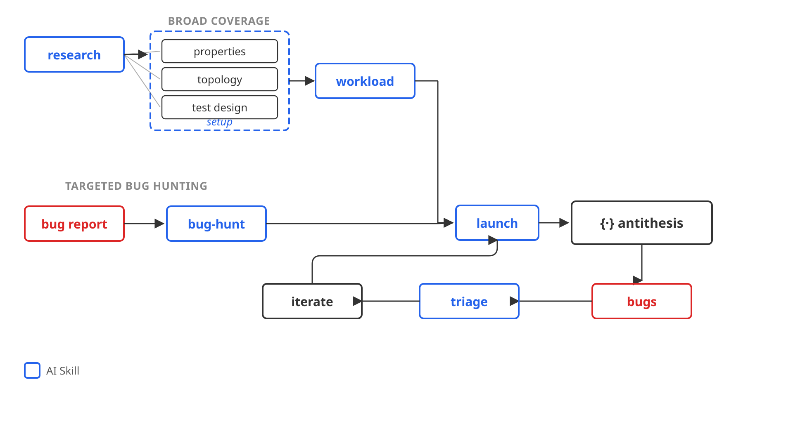

# antithesis-skills

Enable AI agents to incorporate Antithesis into how you build and test software.

> Table of contents:  
> **[Working with LLM agents](#working-with-llm-agents)** · **[Recommended workflow](#recommended-workflow)** · **[Starter prompts](#starter-prompts)** · **[Choosing a model](#choosing-a-model)** · **[Prerequisites](#prerequisites)** · **[Install](#install)**

## Skills overview

`antithesis-documentation` is a foundational skill that enables agents to work with [our docs](https://antithesis.com/docs/) more efficiently. It's used by several of our other skills. You can also use it to ask questions about how to use Antithesis.

`antithesis-research`, `antithesis-setup`, and `antithesis-workload` work together to bootstrap a new system into Antithesis. Together, they will:

- Analyze your system to provide a basic catalog of relevant [reliability properties](https://antithesis.com/docs/resources/reliability_glossary/).
- Provide a suggested system topology for testing.
- Handle your [initial deployment to Antithesis](https://antithesis.com/docs/getting_started/setup/).
- Create a basic [test template](https://antithesis.com/docs/test_templates/) to validate properties in the catalog.

**`antithesis-research` produces planning artifacts that you should review carefully.**

> [!IMPORTANT]
> `antithesis-research` is thorough by design. It fans out across sub-agents to study your system from several angles — reading source, comments, docs, commit history, and issues — then runs multiple evaluation passes over the properties it discovers. That depth is what makes the artifacts valuable, but it also means the run is not quick: on most codebases, expect it to work for > _30 minutes to an hour_* and to use a meaningful amount of tokens along the way.

`antithesis-bug-hunt` hunts for a specific known or suspected bug. It performs targeted codebase analysis around the bug, builds a self-driving reproduction workload, and iterates locally and in Antithesis until the bug is found. It handles open bug reports, closed bugs you want to verify the fix holds for, and suspected weaknesses in a system area.

`antithesis-setup-k8s` enables agents to adapt Kubernetes manifests to run inside Antithesis. Given Kubernetes manifests in any form (helm charts, kustomize, raw YAML), the skill drives an interview-based workflow to adapt, convert, and validate manifests to work in Antithesis. This skill is still in development and does not provide all the same tools as `antithesis-setup`, specifically regarding instrumentation and SDK usage.

`antithesis-triage` enables agents to parse and analyze the results of your Antithesis test runs.

`antithesis-debug` enables agents to interactively debug Antithesis test runs using the [multiverse debugger](https://antithesis.com/docs/multiverse_debugging/) — inspecting container filesystems and runtime state, running shell commands, and extracting evidence from inside the Antithesis environment.

`antithesis-query-logs` enables agents to search across all timelines in an Antithesis test run to find events, correlate property failures, and answer temporal questions about ordering and causation — e.g., cascade elimination, fault correlation, and root cause hypothesis testing.

`antithesis-agent-browser` is a helper skill that handles interactive browser authentication to your Antithesis tenant and reads Antithesis web pages. Other skills (e.g. `antithesis-debug`, `antithesis-query-logs`) delegate to it when they need authenticated web access; you usually won't invoke it directly.

`antithesis-launch` enables agents to build the harness, run `snouty validate`, and submit `snouty launch` with sensible metadata once the harness is ready.

`antithesis-skills-feedback` helps you file bug reports against these skills by opening a pre-filled GitHub issue.

> [!NOTE]
> These skills are under active development. LLMs are inherently non-deterministic, so they may not work perfectly with your AI. Please do file issues and submit PRs as you come across ways to improve them.

## Working with LLM agents

These skills run inside an agent like Claude Code or Codex. Using them well means knowing how to work with the agent itself, not just the skills.

If you're new to agentic tools, or you've been using them for a while and want to dig deeper, read [Getting Started with Antithesis Skills](getting-started-documentation/). It's a companion guide covering mental model, day-to-day working patterns, context and memory, building up your harness, and recognizing failure modes.

## Recommended workflow

<p align="center">
  
</p>

Pick a starting point based on what you're trying to do: build broad test coverage for a system, or hunt for a specific bug.

### Broad coverage

Start here when you're bringing a new system into Antithesis or want to build out general test coverage.

Run `antithesis-research`, `antithesis-setup`, and `antithesis-workload` in order and in separate fresh contexts. After running each skill review all of the changes made so far, and iterate on them before continuing to the next skill.

If your system runs on Kubernetes, run `antithesis-setup-k8s` instead of `antithesis-setup` to help shape your Kubernetes manifests and kick off an Antithesis test that uses Kubernetes as the container orchestrator. This skill is currently in development and does not provide the same experience as `antithesis-setup` involving instrumentation and SDK usage.

Once the harness is in place, use `antithesis-launch` to run `docker compose build`, `snouty validate`, and `snouty launch` in the right order. We recommend running this after the setup and workload skills to ensure everything is working well.

### Targeted bug hunting

Start here when you have a specific known or suspected bug to reproduce.

Run `antithesis-bug-hunt` with a bug report, issue, or description of the suspected weakness. The skill handles system orientation, targeted codebase analysis, workload building, and iteration — you don't need to run `antithesis-research` or `antithesis-workload` separately.

Bug-hunt starts locally by default: it builds a docker-compose environment and iterates there first. When the trigger hypothesis requires Antithesis capabilities (fault injection, scheduling control), it delegates to `antithesis-setup` and `antithesis-launch` to move to Antithesis runs. After each run, use `antithesis-triage` to check whether the specific bug triggered, and `antithesis-debug` if deeper investigation is needed.

### General advice

Don't hesitate to run short 15-30 minute Antithesis test runs as smoke tests to ensure that the harness is working as expected.

## Starter prompts

To get the most out of the skills, we recommend that your prompts simply provide the required information for the skill.

Here are some example starter prompts.

> [!NOTE]
> There are many ways to invoke a skill, in the examples below, it's invoked with a /skill-name.

### antithesis-research

```
/antithesis-research Research my codebase at /path/to/codebase and prepare a plan to test it with Antithesis.
```

This skill outputs the following research materials, relative to the project directory:

- `antithesis/scratchbook/sut-analysis.md` captures architecture, state, concurrency, and failure-prone areas.
- `antithesis/scratchbook/existing-assertions.md` lists any Antithesis SDK assertions already present in the codebase.
- `antithesis/scratchbook/property-catalog.md` lists concrete, testable properties with priorities.
- `antithesis/scratchbook/deployment-topology.md` describes the minimal useful container topology.
- `antithesis/scratchbook/properties/{slug}.md` per-property evidence files capturing the reasoning, code paths, and key observations behind each property.
- `antithesis/scratchbook/property-relationships.md` maps suspected clusters and connections between properties.
- `antithesis/scratchbook/evaluation/synthesis.md` records categorized evaluation findings and actions taken.
- `antithesis/scratchbook/evaluation/{lens}.md` one per evaluation lens used during property evaluation.

### antithesis-bug-hunt

```
/antithesis-bug-hunt Hunt for this bug: [paste bug report or describe the bug]. The codebase is at /path/to/codebase.
```

This skill produces:

- `antithesis/bug-hunt/<bug-slug>/analysis.md` — trigger hypothesis, codebase findings, classification.
- `antithesis/bug-hunt/<bug-slug>/reproduction.md` — verified reproduction details (when the bug is found).
- A self-driving workload with dual-mode assertions (SDK assertions in Antithesis, local checks otherwise).
- `docker-compose.yml` for local reproduction.

### antithesis-setup (for docker-compose)

```
/antithesis-setup Review the files in @antithesis/scratchbook/, build the things needed to begin testing with Antithesis, and validate the setup locally.
```

This skill initializes an `antithesis/` directory, relative to the project, and adds all newly created setup files there.

Here's an example:

- `antithesis/Dockerfile` performs a multi-stage build of the SUT.
- `antithesis/config/docker-compose.yaml` orchestrates the SUT.
- `antithesis/setup-complete.sh` emits the `setup_complete` lifecycle event.
- `antithesis/AGENTS.md` documents the `antithesis/` directory.

### antithesis-setup-k8s

```
/antithesis-setup-k8s Review my Kubernetes manifests at /path/to/manifests. The system that I'd like to put under test is <description of core system under test>. Build a set of minimized Kubernetes manifests to get my application running in Antithesis, test them out, and kick off a test via antithesis-launch.
```

This skill initializes an `antithesis/` directory and creates manifests there along with some other helpful tools to understand the AI's thinking.

Here's an example:

- `antithesis/config/manifests` are the manifests that will be run in Antithesis
- `antithesis/scratchbook/k8s-minimization/working.md` will contain the progress of the AI during the skill. Refer to this to understand the decisions that the AI made.

### antithesis-workload

```
/antithesis-workload Review the plan for testing with Antithesis in @antithesis/scratchbook/property-catalog.md and implement a workload for a single property to start.
```

This skill implements Antithesis workloads and places all the test commands and supporting files under `antithesis/test/`, adds assertions to carefully chosen locations in the SUT.

### antithesis-launch

```
/antithesis-launch Launch an Antithesis run from this repo for 30 minutes.
```

This skill discovers the Antithesis config, builds the harness, validates it with `snouty validate`, and only submits `snouty launch` if validation succeeds.

## Compatibility

**Platform**: macOS or Linux.

**AI agent**: Tested with [Claude Code](https://code.claude.com/docs) and [OpenAI Codex](https://learn.chatgpt.com/docs/codex/cli). These skills work best with agents that can spawn sub-agents for self-review. Other agents that support skills may also work.

## Choosing a model

These skills work well with mid-tier models. They were designed and tested with Claude Opus 4.6, and models at that level — older Sonnets, or similar from other providers — are a good starting point. If you think a particular skill isn't performing well enough, try a more capable model for that skill before upgrading across the board.

Some skills are heavy on input tokens — `antithesis-research` in particular. Using a frontier model where a mid-tier one performs just as well has a real impact on spend and quota usage for minimal to no gain.

## Prerequisites

You'll need an AI agent, npm, Docker Compose v2, a container engine (Docker or Podman), and the Snouty CLI. See [PREREQUISITES.md](PREREQUISITES.md) for the full list and platform-specific installation instructions.

## Permissions

These skills invoke external tools (Docker Compose, Docker, Snouty, agent-browser) that your AI agent may prompt you to approve. The skills themselves do not configure permissions — that's up to you based on your security preferences.

Here are the tools each skill may invoke, so you can pre-approve them if you prefer fewer interruptions:

| Skill                      | Tools used                                                     |
| -------------------------- | ------------------------------------------------------------ |
| `antithesis-bug-hunt`      | `docker compose`/`docker-compose`, `docker`/`podman`           |
| `antithesis-research`      | No explicit external tools                                     |
| `antithesis-setup`         | `docker compose`/`docker-compose`, `docker`/`podman`, `snouty` |
| `antithesis-setup-k8s`     | `docker`/`podman`, `snouty`                                    |
| `antithesis-workload`      | `snouty`                                                       |
| `antithesis-launch`        | `docker compose`/`docker-compose`, `docker`/`podman`, `snouty` |
| `antithesis-triage`        | `snouty`, `jq`                                                 |
| `antithesis-debug`         | `agent-browser`, `jq`                                          |
| `antithesis-query-logs`    | `snouty`, `agent-browser`, `jq`                                |
| `antithesis-agent-browser` | `agent-browser`, `jq`                                          |
| `antithesis-documentation` | `snouty docs`                                                  |

## Install

### npx skills installer

The recommended way to install our skills in all of your AI agents is via the `npx skills` installer:

```bash
npx skills add antithesishq/antithesis-skills
```

The installer presents an interactive menu. Choose the following options:

1. **Skills** — select the skills you need:
   - `antithesis-bug-hunt`
   - `antithesis-documentation`
   - `antithesis-research`
   - `antithesis-setup`
   - `antithesis-setup-k8s`
   - `antithesis-triage`
   - `antithesis-workload`
   - `antithesis-debug`
   - `antithesis-query-logs`
   - `antithesis-agent-browser`
   - `antithesis-launch`
   - `antithesis-skills-feedback`
2. **Pick agents** - make sure to select **Claude Code** if you want to use our skills with Claude, as it's not enabled by default.
3. **Install scope** — choose **global**, not project.
4. **Install method** — choose **symlink**.
5. **Install find-skills skill** — choose **No**.

Restart any open agent sessions after installing so the new skills are discovered.

To update: `npx skills update`. To uninstall: `npx skills remove` and select the `antithesis` prefixed skills.

## Contributing

See [CONTRIBUTING.md](CONTRIBUTING.md) for development setup and validation commands.
