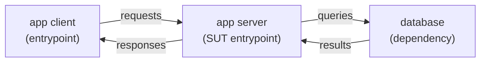
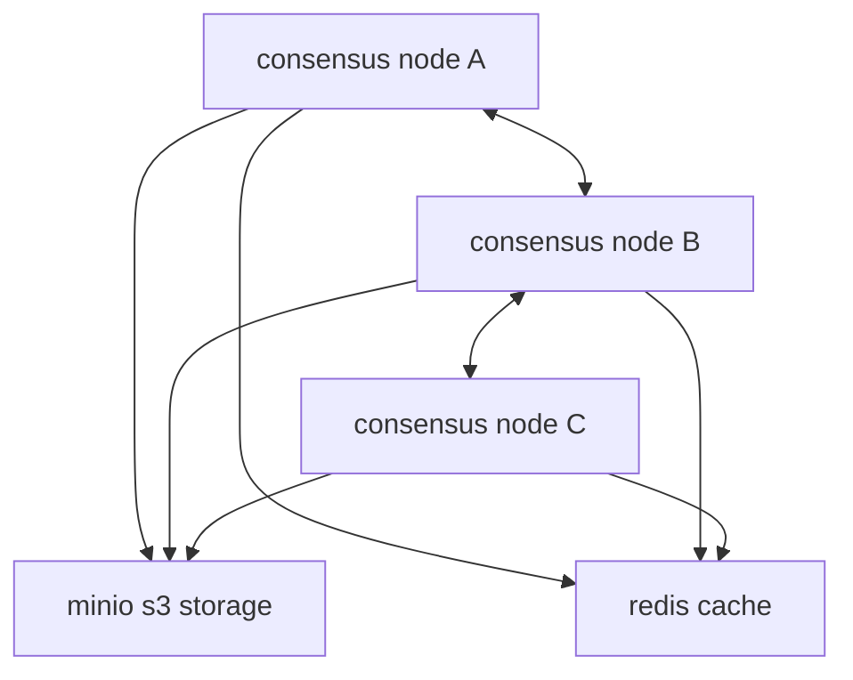

# Antithesis Bootstrap

## Purpose and Goal

Use this skill to setup a project to run in Antithesis. To learn about Antithesis, use the `Antithesis Documentation` skill, which should prefer `snouty docs` and otherwise request markdown documentation pages directly.

Success means the user has:

- One or more pre-built Linux x86-64 Docker images for their system under test and dependencies.
- A `docker-compose.yaml` that can run hermetically (no internet).
- A reliable `setup_complete` signal to let Antithesis know when it can start running scenarios.
- The ability to launch an Antithesis run via `snouty run`.

After this skill completes, suggest to run the `antithesis-workload` skill to add a synthetic workload and assertions.

## Definitions and Concepts

- SUT: System under test. Do not expose this term to users, just used within this file. Refers to the project as a whole that the user wants to run in Antithesis.

## Recommended Requirements

Make sure you can access current documentation through the `antithesis-documentation` skill. Prefer `snouty docs`; if `snouty` is unavailable, request markdown documentation pages directly from `https://antithesis.com/docs/`.

## Documentation Grounding

The following documentation pages contain the most relevant content and should be used to ground your understanding before integration begins.

- Instrumentation overview: `https://antithesis.com/docs/instrumentation.md`
- Handling external dependencies: `https://antithesis.com/docs/reference/dependencies.md`
- Docker best practices: `https://antithesis.com/docs/best_practices/docker_best_practices.md`
  Ignore the recommendation about not using `compose build`, it is outdated.

## Step-by-Step Workflow

Perform each of the following steps in order, revisiting the previous steps as needed until you're satisfied with the outcome. Record plans, notes, and tasks in the notebook directory you will create in step 1.

1. Create a working directory for Antithesis
2. Analyse minimal components
3. Plan testing configuration
4. Create directory structure and docker compose file
5. Start compose and fix problems

### 1. Create a working directory for Antithesis

Create a directory called `antithesis` at the repository root, unless the user specifies otherwise. This directory will contain Antithesis configuration, entrypoints, and scripts.

Initialize the directory with the files in assets/antithesis (relative to this skill). Read `AGENTS.md` to familiarize yourself with the purpose of the files in the directory.

The `antithesis` directory contains a subdirectory called `notebook`. Use this directory as persistent memory of what you have learned, planned, and decided as you work. Refer to the notebook directory as needed to reference previous decisions or parallelize your work using subagents.

### 2. Analyse minimal components

Begin with a comprehensive analysis of the system to determine the simplest topology that covers the code to verify.

Figure out which services and dependencies must run. Generally, we recommend putting components in separate images where possible.

A simple client-server project might be as simple as this:



Or you may have to build something more complex:



The deployment topology for Antithesis should be the simplest topology in which you can validate and potentially find errors in the properties you have selected.

The less you deploy to Antithesis while still covering the code you want to verify, the better the system will perform and find bugs.

IMPORTANT: Ask the user to clarify anything you're unsure about regarding the system's architecture or what they want to test.

**Output of this step:**

Document what you have learned and planned with regard to the ideal System Under Test (SUT) for this project. Write this information to the notebook directory.

### 3. Plan testing configuration

Now that you understand the SUT, plan the work required to deploy it to Antithesis.

Break down the SUT into three groups: dependencies, services, and clients.

Dependencies are usually the simplest to prepare. You just need to track down a Docker image that runs, simulates, or mocks the dependency. For example, if the project depends on Postgres, then use the official Postgres Docker Image. Alternatively, if the project depends on AWS S3, you'll need to find a S3 compatible service such as Minio.

Services include all of the processes that make up the SUT. You only need to figure out how to package the services we actually plan to put under test. Figure out how to split up services between containers, and either find existing Docker files in this project or create new Dockerfiles.

Clients are out of scope for now, as they are covered by the antithesis-workload skill.

Keep the following in mind when planning:

- **Minimise memory**: Reduce JVM heap sizes, thread pools, buffer pools, and other memory-hungry configuration small. Antithesis runs many timelines in parallel, so smaller footprints = more coverage.
- **Tune periodic operations**: Reduce intervals for GC, compaction, checkpoints, and other periodic operations. Shorter intervals mean Antithesis can explore more states in the same amount of time.
- **Plan container topology**: Figure out which components need their own containers and which can share.
- **Identify reusable Dockerfiles**: Check if the project already has Dockerfiles you can reuse or extend rather than writing from scratch.

**Output of this step:**

Document the different components composing the System Under Test (SUT) and the configuration plan. Write this information to the notebook directory.

### 4. Create directory structure and docker compose file

> **Podman Compose compatibility:** Antithesis uses `podman compose` behind the scenes.
> If `podman compose` is available on the system, use it; otherwise fall back to `docker compose`.

The goal of this step is to create a working Docker compose configuration in `antithesis/config/docker-compose.yaml`. To do this you will need to create or adjust Dockerfiles so that all required components in the SUT can either be pulled or built.

Every service in `docker-compose.yaml` must include both `image:` and `build:` stanzas. The `image:` stanza names the image for pushing to a registry; the `build:` stanza allows local builds via `compose up --build`.

If you need a reliable way to communicate between containers, mount a named volume to every container. This is very useful for sharing configuration files for example.
Place configuration files next to the `docker-compose.yaml` and use read-only mounts to access them from containers.

Do not add test-composer directories, workload containers, or assertions at this stage — those will be
added by the `antithesis-workload` skill. You may add a dummy workload container using the
`antithesis/setup-complete.sh` to ensure that the `setup-complete` event is emitted.

**Output of this step:**

A `docker-compose.yaml` and any required Dockerfiles that bring up the SUT. No changes to the source code
of the SUT, no assertions.

### 5. Start compose and fix problems

Use the `antithesis/test.sh` script to test the environment locally and iterate until the SUT starts cleanly.

Carefully review all files in the antithesis deployment directory against this implementation plan. Ensure that the `antithesis/submit.sh` script is updated to build the required Docker images, tag any private images referenced by `docker-compose.yaml` under `ANTITHESIS_REPOSITORY`, and then launch the run with `snouty run`. Prefer passing `--config antithesis/config`, which causes Snouty to discover and push matching `image:` references from `docker-compose.yaml` and then build and push the config image automatically. Then notify the user that they may run their first Antithesis test.

Guide the user to set the required env variables for the current Snouty CLI flow. In particular, make sure `ANTITHESIS_REPOSITORY` points at the remote registry/repository where Snouty should push the generated config image. Also make sure Docker or Podman is already configured to authenticate to that registry before launching the run. For registries provisioned by Antithesis, onboarding usually covers this setup. For user-owned registries, the user must configure Docker or Podman login themselves. Then run the submit script. Start with a short duration to verify that the SUT is working as expected. You may need to iterate with the user to fix any issues discovered during deployment. Make sure you write down any discovered issues to your notebook to prevent them in the future.

```sh
export ANTITHESIS_REPOSITORY=...

./antithesis/submit.sh \
  --duration 30 --desc "first test run"
```

Always use `--webhook basic_test` and `--config ./antithesis/config`. Default `--recipients` to the current git user email if set. Start with a short duration to verify that the SUT is working as expected.

**Output of this step:**

A working setup where `test.sh` passes and the user can launch a run. You may need to iterate with the user to fix any issues discovered during deployment. Make sure you write down any discovered issues to your notebook to prevent them in the future.

## Key outputs

- A working compose setup
